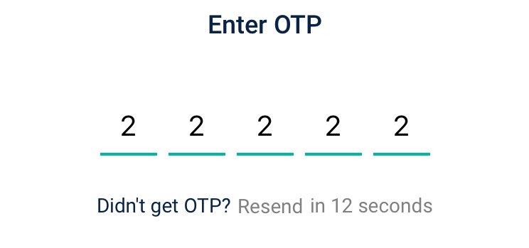
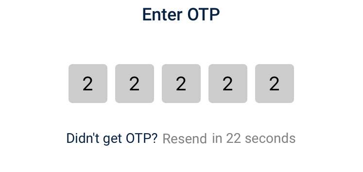
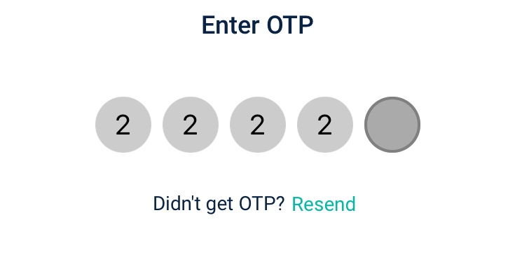
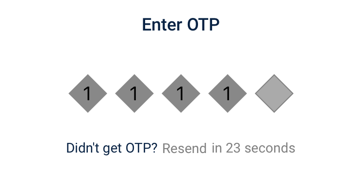
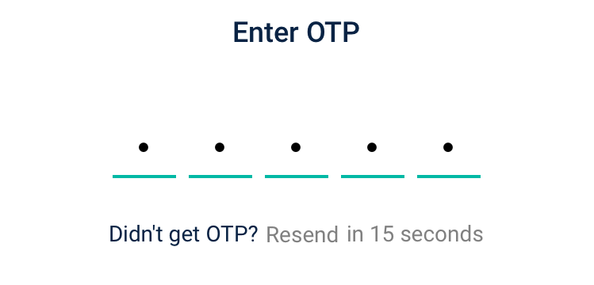

# OTPFieldView
One Time Password View for iOS. Built in Swift 5

<p align="left">
<a href="https://developer.apple.com/swift"></a>

<a href="https://raw.githubusercontent.com/maxsokolov/tablekit/master/LICENSE"></a>
</p>

### Preview







## Installation

### CocoaPods

Add the following line to your Podfile:

```ruby
pod 'OTPFieldView'
```

Then run the following in the same directory as your Podfile:
```ruby
pod install
```

## Usage

### Code
```swift
@IBOutlet var otpTextFieldView: OTPFieldView!

func setupOtpView(){
        self.otpTextFieldView.fieldsCount = 5
        self.otpTextFieldView.fieldBorderWidth = 2
        self.otpTextFieldView.defaultBorderColor = UIColor.black
        self.otpTextFieldView.filledBorderColor = UIColor.green
        self.otpTextFieldView.cursorColor = UIColor.red
        self.otpTextFieldView.displayType = .underlinedBottom
        self.otpTextFieldView.fieldSize = 40
        self.otpTextFieldView.separatorSpace = 8
        self.otpTextFieldView.shouldAllowIntermediateEditing = false
        self.otpTextFieldView.delegate = self
        self.otpTextFieldView.initializeUI()
    }
```
The `becomeFirstResponderAtIndex` property sets the pinField at the specified index as the first responder.
The `isContentTypeOneTimeCode` property sets the contentType of the first pinField to `.oneTimeCode` to leverage the iOS 12 feature where the passcode is directly fetched from the messages. 

#### Styles
```swift
enum DisplayType: Int {
    case circular
    case roundedCorner
    case square
    case diamond
    case underlinedBottom
}
```

### Delegate Methods

```swift
extension OtpViewController: OTPFieldViewDelegate {
    func hasEnteredAllOTP(hasEnteredAll hasEntered: Bool) -> Bool {
        print("Has entered all OTP? \(hasEntered)")
        return false
    }
    
    func shouldBecomeFirstResponderForOTP(otpTextFieldIndex index: Int) -> Bool {
        return true
    }
    
    func enteredOTP(otp otpString: String) {
        print("OTPString: \(otpString)")
    }
}
```

- **hasEnteredAllOTP()**: Returns true when all text Fields are full.
- **shouldBecomeFirstResponderForOTP()**: Show keyboard automatically.
- **enteredOTP()**: Get entered pin.

### Properties

- **.displayType**: Display type for Text Field.
- **.fieldsCount**: Length of OTP.
- **.otpInputType**: Input type for Text Field : numeric, alphabet, alphaNumeric.

- **.fieldFont**: Font for Text Field.
- **.secureEntry**: Shows • instead of text.
- **.hideEnteredText**: Hides the text.
- **.requireCursor**: Shows/Hides cursor.
- **.cursorColor**: Color for Cursor.
- **.fieldSize**: Size of Text Field.
- **.separatorSpace**: Space between Text Fields.
- **.fieldBorderWidth**: Border width for Text Fields.
- **.shouldAllowIntermediateEditing**: Allow to edit from middle.
- **.defaultBackgroundColor**: Empty text field background color.
- **.filledBackgroundColor**: Filled text field background color.
- **.defaultBorderColor**: Empty text field border color.
- **.filledBorderColor**: Filled text field border color.
- **.errorBorderColor**: Error text field border color.
- **.delegate**: delegate.

## License

OTPFieldView is available under the MIT license. See LICENSE for details.
